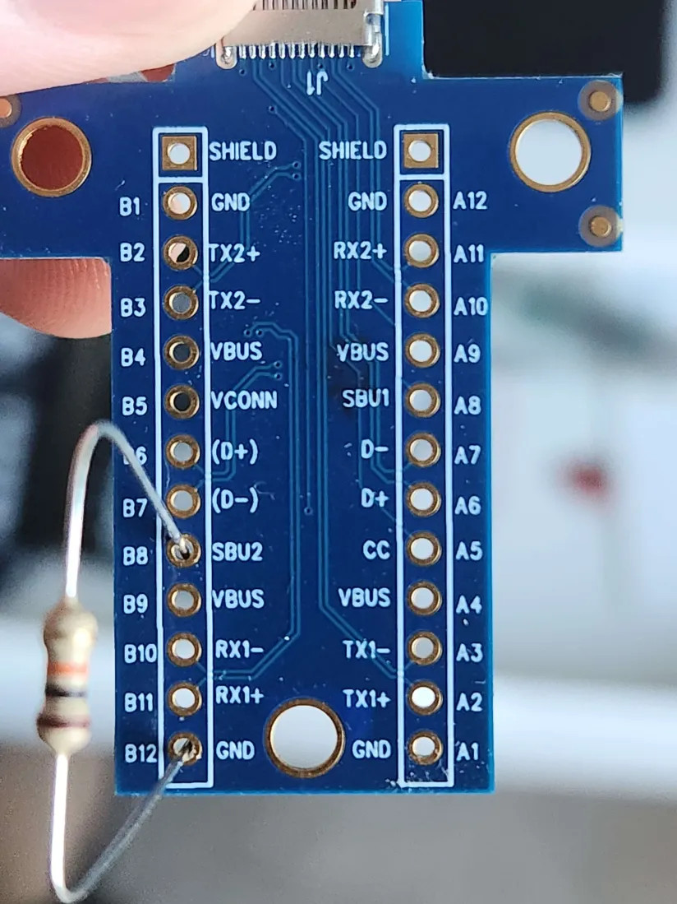
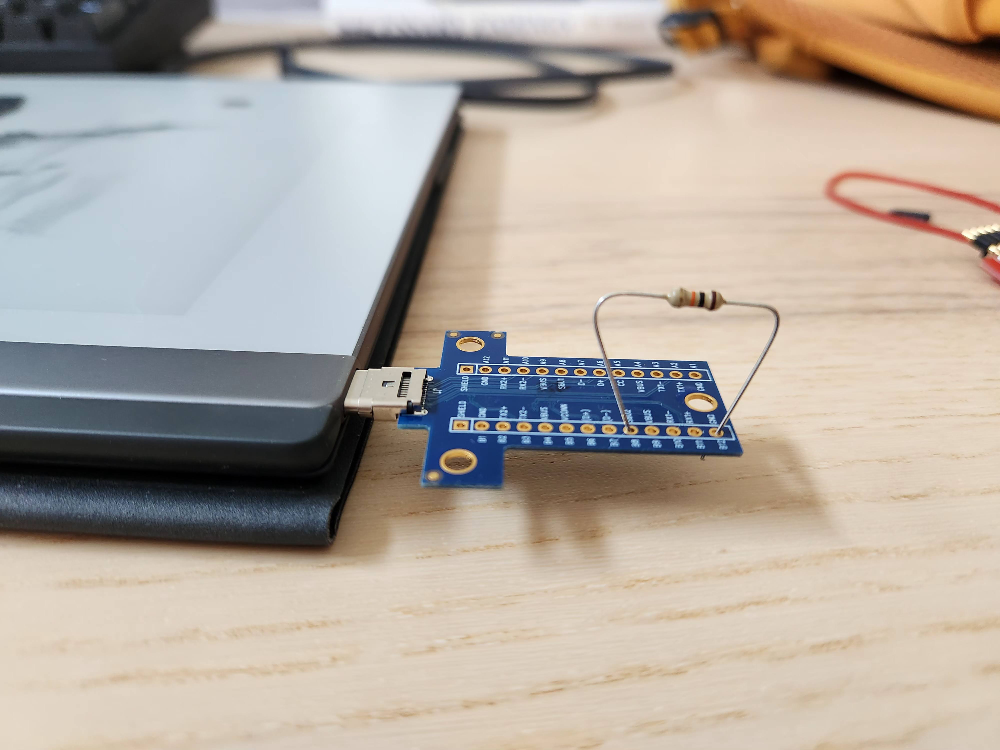
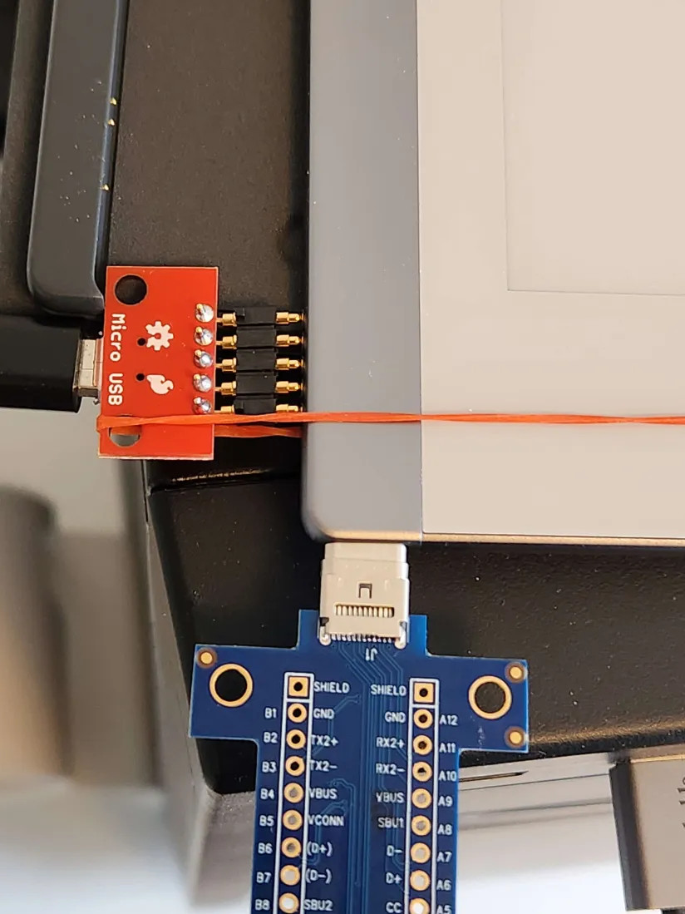
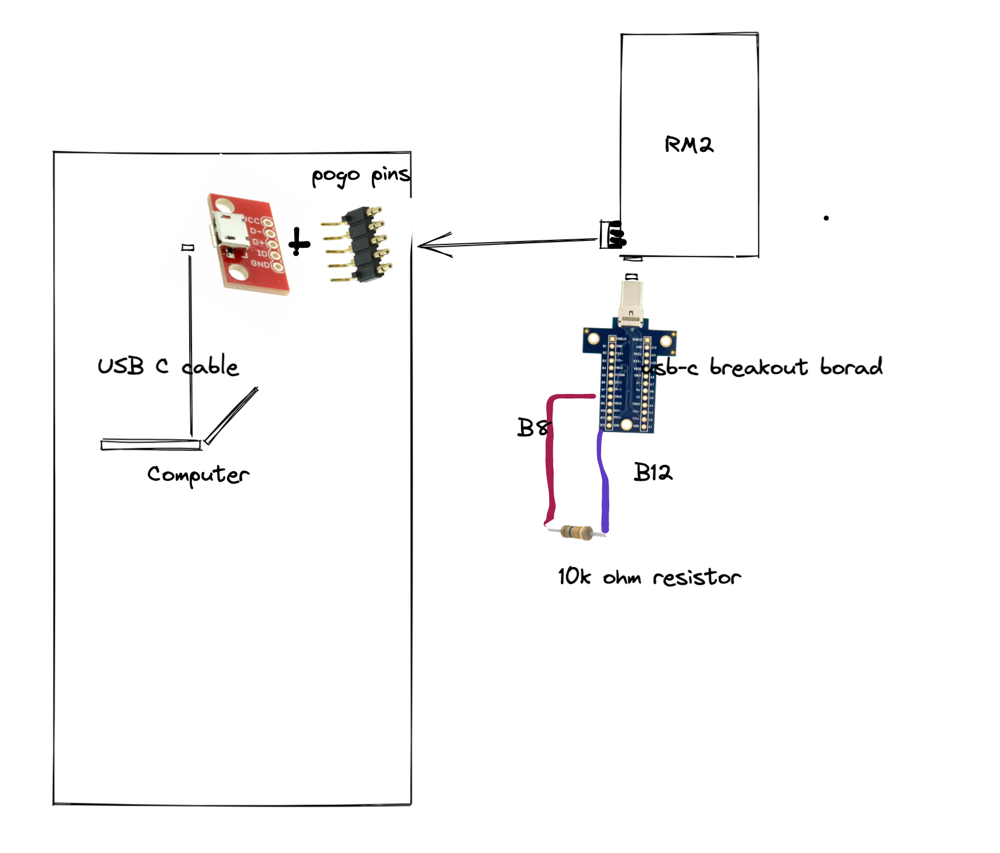

# reMarkable 2 Recovery / Unbricking

Tools for recovery (works only under Linux)

## [Parts and prerequisites](parts.md)

To put the rM2 in recovery, you will need:
- USB-C breakout board (you could probably use USB-C to Audio adapter and plug headpholnes to short B8)
- Pogo pin adapter to usb
    the pogo pins are as follows,  when viewed from the side, device facing up (VBUS is near the usb-c)
    `GND,ID,D+,D-,VBUS`

- [imx_usb_loader](https://github.com/boundarydevices/imx_usb_loader) a binary is included, but feel free to compile it

## Guide
* run `dmesg -w` on your host to monitor
* power off the device (hold the power button for 10 seconds)
* connect the USB-C breakout board
*   pull down **B8** (connect B8 over a 10K resistor to B12)
* connect the pogo pins to the tablet and to the host usb **Make sure the orientation is correct, you risk frying your device if you connect the pins in the wrong order**
* **make sure the connection is good, use a short good, different cable, etc**
* if the device does not start on its own, press the Power Button. The screen may flash and say it's starting. After that, the screen will no longer update.
* you should see a new device *USB HID v1.10 Device [Freescale SemiConductor Inc  SE Blank ULT1]*
* **remove the pulldown resistor (disconnect B8)** *Your device will restart automatically in a loop if you miss this step*
* run `sudo ./imx_usb` or add the [udev](udev.md) rules to use it without `sudo`
* should see *USB Mass Storage device detected*
* should see a new mountable block device

## Next steps
* to recover the ssh password, mount the home partition `grep Developer <mountpoint>/root/.config/remarkable/xochitl.conf`
* to find a mountpoint run `mount | grep home`
* your `dmesg` output will show the letter assigned to the block device (`sdc` will be used for the following examples)
* Open the `uboot.env` file from the root of the `BOOT` partition in a text editor. You'll see something like `active_partition=3`. This indicates that your remarkable boots from sdc3, so we'll use sdc2 to restore the `sdc3` partition. 
* Backup the working system partition using `sudo dd if=/dev/sdc2 of=rm2-sdc2.raw bs=4096 status=progress` or `sudo dd if=/dev/sdc3 of=rm2-sdc3.raw bs=4096 status=progress`.
* Restore the `sdc3` partition with the backup of `sdc2` using `sudo dd if=rm2-sdc2.raw of=/dev/sdc3 bs=4096 status=progress` assuming your active partition is `3`. If your active partition is `2` restore it using `sudo dd if=rm2-sdc3.raw of=/dev/sdc2 bs=4096 status=progress`
* You can instead use [codexctl](https://github.com/Jayy001/codexctl) to download an update file for your device, and extract the image from it. You can then use `dd` to replace the active partition with the stock partition.

## Troubleshooting
* It is **very** important to use a pogo connector because it is almost impossible to achieve a stable connection in another way.
* Only if the device is in recovery mode there will be messages in the `dmesg` output.
* If you see messages like `usb 1-1: device descriptor read/64, error -71`, most likely it means that the device is in recovery mode and you have a poor connection to the pogo port.
* B8 is on the bottom part of the USB port. So screen side is A and bottom side is B.
* if not sure that device is powered off, try to connect the device to the charger, the screen should blink, disconnect it from the charger, hold the power button for at least 15 seconds.

## What the setup looks like

## UART

UART6 TX is exposed via the pogo pins ID pin.

You can connect an FDTI chip (3V3) to ID pin to get UART at 115200 baud.

For more details checkout the wiki: https://web.archive.org/web/20230619082431/https://remarkablewiki.com/tech/rm2_otg_pogo

For details building u-boot and Linux to support this checkout
[meta-freescale-3rdparty](https://github.com/Freescale/meta-freescale-3rdparty).
