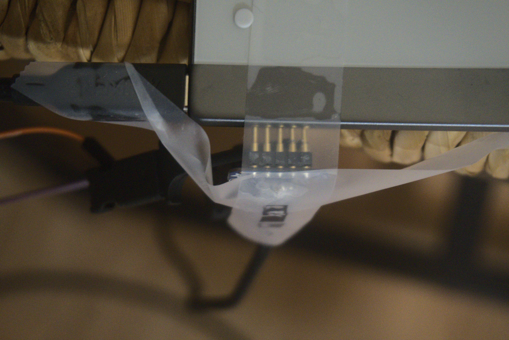
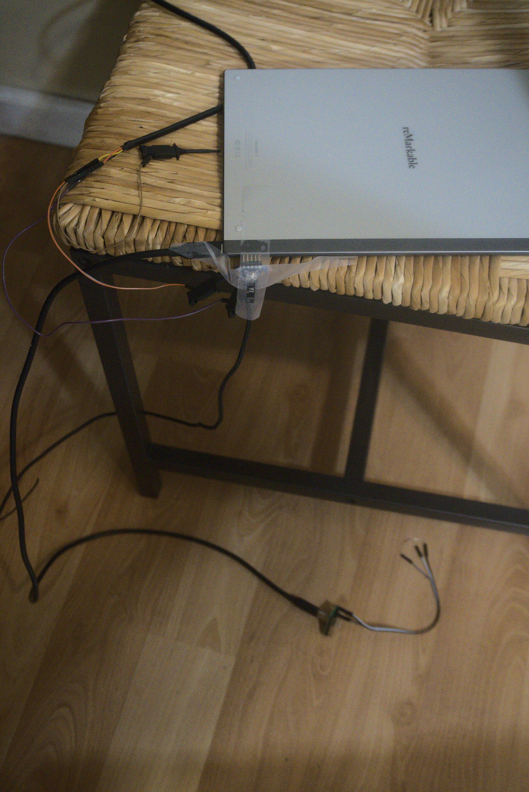

# reMarkable 2 Recovery / Unbricking

Tools for recovery (works only under Linux)

## [Parts and prerequisites](parts.md)

To put the rM2 in recovery, you will need:
- USB-C breakout board (you could probably use USB-C to Audio adapter and plug headpholnes to short B8)
- Pogo pin adapter to usb
    the pogo pins are as follows,  when viewed from the side, device facing up (VBUS is near the usb-c)
    `GND,ID,D+,D-,VBUS`

- [imx_usb_loader](https://github.com/boundarydevices/imx_usb_loader) a binary is included, but feel free to compile it

## Guide
* run `dmesg -w` on your host to monitor
* power off the device
* connect the USB-C breakout board
*   pull down **B8** (connect B8 over a 10K resistor to B12)
* connect the pogo pins to the tablet and to the host usb
* **make sure the connection is good, use a short good, different cable, etc**
* if the device does not start on its own, press the Power Button
* you should see a new device *USB HID v1.10 Device [Freescale SemiConductor Inc  SE Blank ULT1]*
* remove the pulldown resistor (disconnect B8)
* run `sudo ./imx_usb` or add the [udev](udev.md) rules to use it without `sudo`
* should see *USB Mass Storage device detected*
* should see a new mountable block device

## Next steps
* to recover the ssh password, mount the home partition `grep Developer <mountpoint>/root/.config/remarkable/xochitl.conf`
* to find a mountpoint run `mount | grep home`
* TODO not tested, but something like `dd if=raw of=/dev/mountedroot1`

## Troubleshooting
* It is **very** important to use a pogo connector because it is almost impossible to achieve a stable connection in another way.
* Only if the device is in recovery mode there will be messages in the `dmesg` output.
* If you see messages like `usb 1-1: device descriptor read/64, error -71`, most likely it means that the device is in recovery mode and you have a poor connection to the pogo port.
* B8 is on the bottom part of the USB port. So screen side is A and bottom side is B.
* if not sure that device is powered off, try to connect the device to the charger, the screen should blink, disconnect it from the charger, hold the power button for at least 15 seconds.

## What the setup looks like

## UART

UART6 TX is exposed via the pogo pins ID pin.

You can connect an FDTI chip (3V3) to ID pin to get UART at 115200 baud.

For more details checkout the wiki: https://remarkablewiki.com/tech/rm2_otg_pogo

For details building u-boot and Linux to support this checkout
[meta-freescale-3rdparty](https://github.com/Freescale/meta-freescale-3rdparty).
